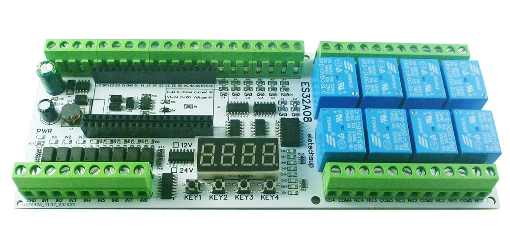
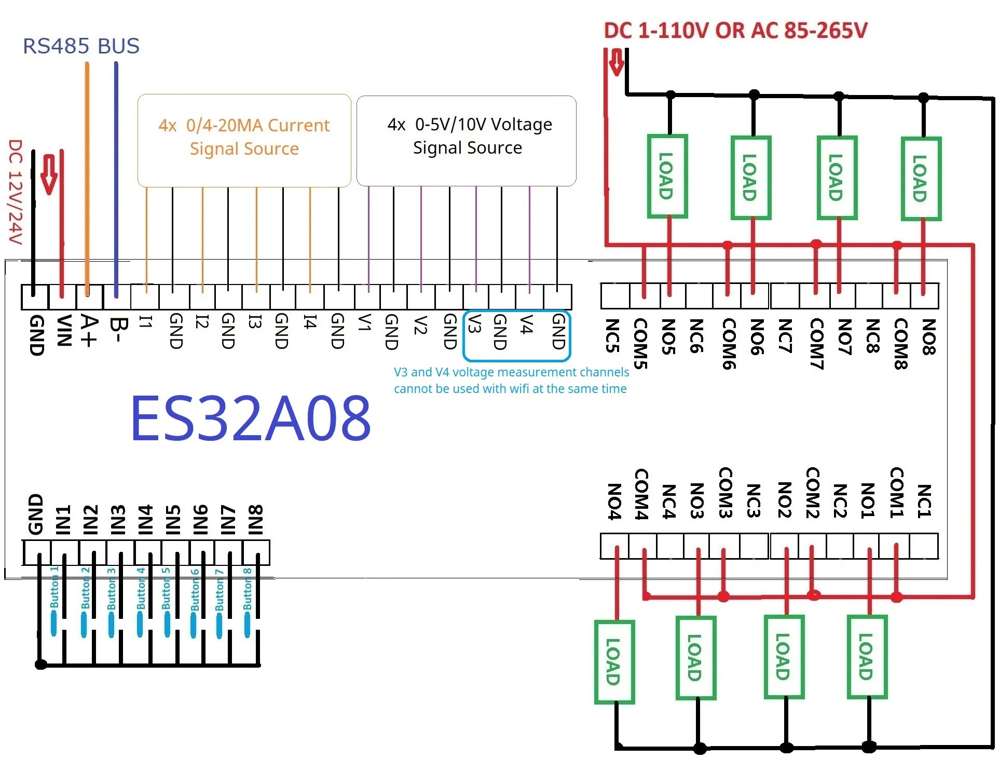

# ES32A08

Arduino ESP32-WROOM library for the **ES32A08** industrial control board.




## Table of Contents

- [Features](#features)
- [Hardware Overview](#hardware-overview)
- [Pin Mapping](#pin-mapping)
- [Installation](#installation-on-arduino-ide)
- [Quick Start](#quick-start)
- [API Reference](#api-reference)
  - [Initialization](#initialization)
  - [Analog Inputs](#analog-inputs)
  - [Digital Inputs](#digital-inputs)
  - [Relay Control](#relay-control)
  - [7-Segment Display](#7-segment-display)
  - [Buttons & LED](#buttons--led)
  - [Configuration](#configuration)
- [Hardware Architecture](#hardware-architecture)
- [License](#license)

---

## Features

- **8 relay outputs** — controllable individually or as a group via a 74HC595D shift register
- **4-digit 7-segment display** — supports digits, decimal points, and alphanumeric characters
- **4× 4-20mA analog inputs** — channels mapped to GPIO 36, 39, 34, 35
- **4× 0-10V analog inputs** — channels mapped to GPIO 32, 33, 25, 26
- **8 digital inputs** — read via a 74HC165 shift register
- **4 onboard buttons** — GPIO 18, 19, 21, 23 (active-low with internal pull-up)
- **Onboard PWR LED** — GPIO 15 (active-low)
- **Real-time display refresh** — FreeRTOS task on Core 1 handles multiplexing

---

## Hardware Overview

| Component              | Quantity | Interface          |
|------------------------|----------|--------------------|
| Relay outputs          | 8        | 74HC595D (SPI-like) |
| 7-segment display      | 1× 4-digit | 74HC595D (daisy-chained) |
| 4-20mA analog inputs   | 4        | ESP32 ADC          |
| 0-10V analog inputs    | 4        | ESP32 ADC          |
| Digital inputs         | 8        | 74HC165 (SPI-like) |
| Buttons                | 4        | GPIO (INPUT_PULLUP) |
| PWR LED                | 1        | GPIO (OUTPUT)      |

---

## Pin Mapping

### Shift Register Pins (74HC595D — Relays + Display)

| Pin      | GPIO | Function             |
|----------|------|----------------------|
| DATA     | 13   | SI (Serial Input)    |
| LATCH    | 14   | RCLK (Latch)         |
| CLOCK    | 27   | SRCLK (Clock)        |
| OE       | 4    | Output Enable (active-low) |

### Shift Register Pins (74HC165 — Digital Inputs)

| Pin      | GPIO | Function             |
|----------|------|----------------------|
| LOAD     | 16   | PL (Parallel Load)   |
| CLK      | 17   | Clock                |
| DATA     | 5    | Q7 (Serial Output)   |

### Analog Inputs

| Type       | Channel 1 | Channel 2 | Channel 3 | Channel 4 |
|------------|-----------|-----------|-----------|-----------|
| 4-20mA     | GPIO 36   | GPIO 39   | GPIO 34   | GPIO 35   |
| 0-10V      | GPIO 32   | GPIO 33   | GPIO 25   | GPIO 26   |

### Buttons

| Button     | GPIO |
|------------|------|
| Button 1   | GPIO 18 |
| Button 2   | GPIO 19 |
| Button 3   | GPIO 21 |
| Button 4   | GPIO 23 |

---

## Installation on Arduino IDE

1. Download or clone this repository.
2. Copy the entire `ES32A08-main` folder into your Arduino libraries directory:
   ```
   <Sketchbook>/libraries/ES32A08/
   ```
3. Ensure the board is set to an **ESP32-WROOM** module (e.g., "ESP32 Dev Module").
4. Restart the Arduino IDE.

---

## Quick Start

```cpp
#include <ES32A08.h>

ES32A08 board;

void setup() {
  board.begin();

  // Turn on relay 1
  board.setRelay(1, HIGH);

  // Display a value
  board.display(42.5);

  // Read analog input
  float voltage = board.readAnalogVoltage(1);
  float current = board.readAnalogmA(2);

  // Read digital input
  bool inputState = board.readDigitalInput(3);

  // Read button
  bool buttonPressed = board.readButton(1);
}

void loop() {
  // Application logic
}
```

---

## API Reference

### Initialization

#### `void begin()`

Initializes all board peripherals: configures shift register pins, sets up the 74HC165 digital input register, configures button pins as `INPUT_PULLUP`, and starts a FreeRTOS task on Core 1 for continuous 7-segment display refresh.

```cpp
board.begin();
```

#### `void reset()`

Resets the board state: opens all relays, clears the display, and sets the PWR LED according to `RESET_LED_ON`.

```cpp
board.reset();
```

---

### Analog Inputs

#### `float readAnalogmA(int channel)`

Reads a 4-20mA input channel and returns the current in **milliamps**.

- **Parameters:** `channel` — 0 to 3
- **Returns:** Current value in mA (4–20 range), or `0` if channel is invalid.
- **Mapping:** Channel 0 → GPIO 36, Channel 1 → GPIO 39, Channel 2 → GPIO 34, Channel 3 → GPIO 35

```cpp
float current = board.readAnalogmA(0);  // Read channel 1 (mA)
```

#### `float readAnalogVoltage(int channel)`

Reads a 0-10V input channel and returns the voltage in **volts**.

- **Parameters:** `channel` — 0 to 3
- **Returns:** Voltage value (0–10 range), or `0` if channel is invalid.
- **Mapping:** Channel 0 → GPIO 32, Channel 1 → GPIO 33, Channel 2 → GPIO 25, Channel 3 → GPIO 26

```cpp
float voltage = board.readAnalogVoltage(2);  // Read channel 3 (0-10V)
```

#### `int rawReadAnalogVoltage(int channel)`

Reads the raw ADC value (0–4095) from a 0-10V input channel without scaling.

- **Parameters:** `channel` — 0 to 3
- **Returns:** Raw ADC value (0–4095), or `0` if channel is invalid.

```cpp
int raw = board.rawReadAnalogVoltage(1);
```

---

### Digital Inputs

#### `bool readDigitalInput(int inputNumber)`

Reads a single digital input (1–8).

- **Parameters:** `inputNumber` — 1 to 8
- **Returns:** `true` if the input is HIGH, `false` otherwise.

```cpp
bool state = board.readDigitalInput(5);  // Read digital input 5
```

#### `uint8_t readDigitalInputs()`

Reads all 8 digital inputs at once and returns them as a byte (bit 0 = input 1, bit 7 = input 8).

- **Returns:** 8-bit value representing all digital input states.

```cpp
uint8_t allInputs = board.readDigitalInputs();
```

---

### Relay Control

#### `void setRelay(int relay, bool state)`

Sets a single relay to the specified state.

- **Parameters:**
  - `relay` — 1 to 8
  - `state` — `HIGH` (on) or `LOW` (off)

```cpp
board.setRelay(3, HIGH);   // Turn on relay 3
board.setRelay(3, LOW);    // Turn off relay 3
```

#### `void setRelays(unsigned long relayStates)`

Sets all 8 relays simultaneously using a bitmask.

- **Parameters:** `relayStates` — 8-bit value (e.g., `0b10101010`)
  - Bit 0 = Relay 1, ..., Bit 7 = Relay 8

```cpp
board.setRelays(0b11001100);  // Relays 3,4,7,8 ON; others OFF
```

---

### 7-Segment Display

#### `void display(int number)`

Displays an integer on the 4-digit display.

- **Parameters:** `number` — range -999 to 9999
- **Overflow behavior:** Displays `" -- "` if the number is out of range.

```cpp
board.display(42);      // Shows "  42"
board.display(-15);     // Shows " -15"
board.display(9999);    // Shows " 9999"
board.display(10000);   // Shows " -- " (overflow)
```

#### `void display(float number)`

Displays a float on the 4-digit display with 2 decimal places.

- **Parameters:** `number` — range -999.00 to 9999.99
- **Overflow behavior:** Displays `" -- "` if the number is out of range.
- **Decimal point:** Automatically positioned based on the value.

```cpp
board.display(42.5);    // Shows " 42.5"
board.display(3.14);    // Shows " 3.14"
board.display(-7.28);   // Shows "-7.28"
```

#### `void display(const char *message)`

Displays a custom 4-character message on the display.

- **Parameters:** `message` — null-terminated string (up to 4 characters)
- **Supported characters:** Digits `0-9`, decimal point `.`, minus `-`, underscore `_`, space ` `, and letters `A-Z, a-z` (uppercase preferred).

```cpp
board.display("HELLO");  // Shows "HELLO" (4 chars)
board.display("OFF");    // Shows " OFF"
board.display("ERR");    // Shows " ERR"
```

#### `void clearDisplay()`

Clears the entire 7-segment display (turns off all segments).

```cpp
board.clearDisplay();
```

---

### Buttons & LED

#### `bool readButton(int buttonNumber)`

Reads the state of a single button.

- **Parameters:** `buttonNumber` — 1 to 4
- **Returns:** `true` if the button is **pressed** (active-low), `false` otherwise.

```cpp
if (board.readButton(1)) {
  // Button 1 is pressed
}
```

#### `void setPWRLED(bool state)`

Sets the onboard PWR LED.

- **Parameters:** `state` — `HIGH` (on) or `LOW` (off)
- **Note:** The LED is **active-low** (HIGH = LED on).

```cpp
board.setPWRLED(HIGH);  // Turn PWR LED on
board.setPWRLED(LOW);   // Turn PWR LED off
```

---

### Configuration

These `#define` constants can be overridden in your sketch **before** including the library:

| Constant            | Default | Description                                    |
|---------------------|---------|------------------------------------------------|
| `RESET_RELAY_ON`    | `false` | Relay state at boot (`false` = all off)       |
| `RESET_LED_ON`      | `true`  | PWR LED state at boot (`true` = LED on)       |
| `DIGIT_PERS`        | `1000`  | Digit persistence in µS (default = 1ms)       |

```cpp
#define RESET_RELAY_ON true   // All relays ON at boot
#define RESET_LED_ON false    // PWR LED OFF at boot
#define DIGIT_PERS 500        // Faster refresh (500µS per digit)

#include <ES32A08.h>
```

---

## Hardware Architecture

```
┌────────────────────────────────────────────────────────┐
│                    ESP32-WROOM                         │
│                                                        │
│  GPIO 13 ──┐                                           │
│  GPIO 14 ──┼──► 74HC595D (Shift Register)              │
│  GPIO 27 ──┤    ├─► 8× Relay Outputs                   │
│  GPIO  4 ──┘    └─► 4-digit 7-Segment Display          │
│                                                        │
│  GPIO 16 ──┐                                           │
│  GPIO 17 ──┼──► 74HC165 (Shift Register)               │
│  GPIO  5 ──┘    └─► 8× Digital Inputs                  │
│                                                        │
│  GPIO 36 ──► ADC 4-20mA Ch1                            │
│  GPIO 39 ──► ADC 4-20mA Ch2                            │
│  GPIO 34 ──► ADC 4-20mA Ch3                            │
│  GPIO 35 ──► ADC 4-20mA Ch4                            │
│                                                        │
│  GPIO 32 ──► ADC 0-10V  Ch1                            │
│  GPIO 33 ──► ADC 0-10V  Ch2                            │
│  GPIO 25 ──► ADC 0-10V  Ch3                            │
│  GPIO 26 ──► ADC 0-10V  Ch4                            │
│                                                        │
│  GPIO 18 ──► Button 1 (INPUT_PULLUP, active-low)       │
│  GPIO 19 ──► Button 2                                  │
│  GPIO 21 ──► Button 3                                  │
│  GPIO 23 ──► Button 4                                  │
│                                                        │
│  GPIO 15 ──► PWR LED (OUTPUT, active-low)              │
└────────────────────────────────────────────────────────┘
```

### Display Multiplexing

The 7-segment display uses **dynamic multiplexing** driven by a FreeRTOS task:

1. The task iterates over all 4 digits sequentially.
2. For each digit, it sends the digit selector and segment data to the 74HC595D.
3. The `DIGIT_PERS` parameter controls the on-time per digit (default 1ms).
4. At 1ms per digit, the full refresh rate is ~250 Hz, eliminating visible flicker.

---

## License

This project is licensed under the **GNU General Public License v3.0** (GPL-3.0).

See the [LICENSE](LICENSE) file for full terms.

> **Note:** This is copyleft software. Any distribution of modified versions must also be released under the GPL-3.0.
